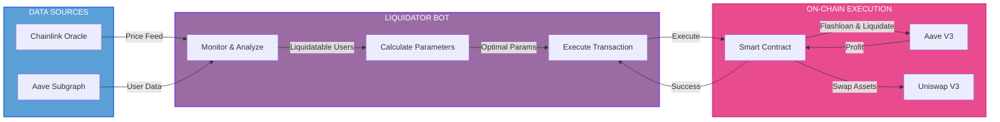

# Aave v3 Liquidator Bot

<p align="center">
  
</p>

<p align="center">
  <strong>Production-ready liquidation bot for Aave V3 on Base Network</strong>
</p>

<p align="center">
  <a href="#overview">Overview</a> •
  <a href="#getting-started">Getting Started</a> •
  <a href="#core-concepts">Core Concepts</a> •
  <a href="#architecture">Architecture</a> •
  <a href="#security">Security</a> •
  <a href="#faq">FAQ</a>
</p>

---

## Overview

### Introduction

Automated liquidation system for Aave V3 on Base Network. This system identifies and liquidates undercollateralized positions in real-time to maintain protocol health.

### Key Features

#### 
- Event-driven architecture with WebSocket
- Low latency execution
- Multicall batching for RPC optimization

#### 
- Implements Aave V3 close factor logic
- Evaluates collateral/debt combinations
- Dynamic gas management with EIP-1559
- Circuit breaker for risk management

#### 
- Full TypeScript implementation
- Modular service architecture
- Comprehensive test coverage
- Deployed on Base Mainnet

---

## Getting Started

### Prerequisites

Before running the bot, ensure your environment meets the following requirements:

#### System Requirements
- Node.js v20+
- npm or yarn
- Linux/macOS (recommended) or Windows WSL2

#### Dependencies

See [package.json](package.json) for complete dependencies list.

#### External Services
- RPC Provider with WebSocket support (Alchemy/Infura)
- Aave V3 Subgraph API key from The Graph
- Wallet with ETH for gas fees

### Installation

#### 1. Clone Repository
```bash
git clone https://github.com/yourusername/aave-liquidation-bot.git
cd aave-liquidation-bot
```

#### 2. Install Dependencies
```bash
# Install Node.js dependencies
npm install

# Install Foundry (for compiling Solidity contracts)
curl -L https://foundry.paradigm.xyz | bash
foundryup

# Install git submodules (Aave contracts)
git submodule update --init --recursive
```

#### 3. Compile Smart Contracts
```bash
# Compile with Foundry
forge build

# Generate TypeChain types
npx hardhat compile
```

### Configuration

#### 1. Environment Variables

```bash
cp .env.example .env
```

Edit `.env` with your configuration. See [.env.example](.env.example) for template and description of each variable.

### Quick Start

#### Run the Bot

```bash
# Development mode (with auto-reload)
npm run dev

# Production mode
npm run start

# With specific log level
LOG_LEVEL=debug npm run start
```

#### Monitor Logs

```bash
# Tail logs in real-time
tail -f logs/liquidator.log

# Filter for liquidation events
grep "Liquidation" logs/liquidator.log

# Monitor success rate
grep "SUCCESS\|FAILED" logs/liquidator.log | tail -n 20
```

#### Run Tests

```bash
# Run all Forge tests
forge test -vvv

# Run specific test file
forge test --match-path test/FlashloanLiquidator.t.sol

# Run with gas report
forge test --gas-report

# Run integration test (TypeScript)
npm run test:integration
```

---

## Core Concepts

### Health Factor

Health Factor (HF) is the metric that determines the health of a borrowing position in Aave.

**Formula:**
```
HF = (Total Collateral × Liquidation Threshold) / Total Debt
```

**Interpretation:**
- `HF > 1.0`: Healthy position (safe)
- `HF = 1.0`: Position at threshold (critical)
- `HF < 1.0`: Position can be liquidated (underwater)

**Example:**
| Health Factor | Status | Action |
|--------------|--------|--------|
| HF > 1.0 | Safe | No action needed |
| HF = 1.0 | Critical | At liquidation threshold |
| HF < 1.0 | Underwater | Eligible for liquidation |

### Liquidation Mechanism

Liquidation is the process where the liquidator pays the underwater user's debt and receives their collateral with a bonus.

**Process Flow:**
1. **Detection**: Bot detects HF < 1.0
2. **Calculation**: Calculate optimal debt to cover
3. **Flashloan**: Borrow debt asset without collateral
4. **Liquidation**: Call Aave's `liquidationCall()`
5. **Receive**: Receive collateral + liquidation bonus
6. **Swap**: Swap collateral → debt asset via Uniswap V3
7. **Repay**: Repay flashloan + fee (0.05%)
8. **Profit**: Keep the difference

**Atomic Transaction:**
All steps above happen in a single transaction. If any step fails, the entire transaction reverts.

### Close Factor

Close Factor determines the maximum percentage of debt that can be liquidated in a single transaction.

**Aave V3 Rules:**
```typescript
if (healthFactor >= 0.95) {
  closeFactor = 0.50; // Max 50% liquidation
} else {
  closeFactor = 1.00; // Max 100% liquidation (full liquidation)
}
```

**Rationale:**
- `HF >= 0.95`: Position still recoverable → partial liquidation only
- `HF < 0.95`: Position severely underwater → allow full liquidation

**Example:**
| Health Factor | Close Factor | Description |
|--------------|-------------|-------------|
| HF ≥ 0.95 | 50% | Partial liquidation only |
| HF < 0.95 | 100% | Full liquidation allowed |

### Liquidation Bonus

Liquidation Bonus is an incentive for liquidators, given as a discount on the collateral received.

**Formula:**
```
Collateral Received = (Debt Covered × Debt Price / Collateral Price) × (1 + Bonus)
```

---

## Architecture

### System Overview

Bot built with modular architecture for scalability and maintainability.



### Services

See implementation at [src/services/](src/services/):

### Smart Contract

→ [contracts/FlashloanLiquidator.sol](contracts/FlashloanLiquidator.sol)

---

## Security

### Access Control

- **Smart Contract**: `onlyOwner` modifier for `executeLiquidation()`
- **Bot Wallet**: Private key/mnemonic must be stored securely
- **Environment Variables**: NEVER commit `.env` to git

### Circuit Breaker

Bot implements circuit breaker to prevent excessive losses with auto-stop on consecutive failures.

### Gas Management

- Fixed gas limit with safety buffer
- EIP-1559 strategy with priority fee
- Sensible limits to prevent gas wars

---

## FAQ

### General

**Q: How much capital is needed to run the bot?**
A: ETH is required for gas fees. The bot uses flashloans so large capital is not needed for liquidation.

**Q: How much profit can be expected?**
A: Depends on network and competition. Each network has different characteristics.

**Q: Is this bot profitable?**
A: Profit potential exists, especially on networks with low competition.

**Q: Is Flashbots needed for Base?**
A: Not required. Public mempool is still effective for Base Network.

### Technical

**Q: How to add support for other networks?**
A: Update config with RPC URLs and addresses for target network. Contract supports any EVM chain with Aave V3.

**Q: Why use Subgraph instead of scanning all users on-chain?**
A: Subgraph provides efficient user discovery with minimal RPC calls.

**Q: How to optimize for lower latency?**
A: Use local node, co-locate server near sequencer, or consider more performant implementation.

**Q: Does the bot handle liquidation protocol fees?**
A: Yes, contract includes fee buffer to cover flashloan premium and swap fees.

### Troubleshooting

**Q: Bot doesn't detect liquidatable users**
A: Check: (1) Subgraph API key valid, (2) RPC connection working, (3) Users with HF < 1.0 exist

**Q: Transactions keep failing**
A: Check: (1) Wallet has enough ETH for gas, (2) Contract address correct, (3) User still liquidatable (HF < 1.0), (4) Competition frontrun transaction

**Q: How to monitor bot health?**
A: Check logs at `logs/liquidator.log`. Monitor for patterns like: consistent failures, circuit breaker triggers, RPC errors.

**Q: Bot crashes on startup**
A: Check: (1) All env variables set, (2) Contract deployed, (3) RPC URL reachable, (4) Dependencies installed

---

## Contributing

Contributions are welcome! Please follow these guidelines:

### How to Contribute

1. **Fork** the repository
2. **Create** a feature branch (`git checkout -b feature/amazing-feature`)
3. **Commit** your changes (`git commit -m 'Add amazing feature'`)
4. **Push** to the branch (`git push origin feature/amazing-feature`)
5. **Open** a Pull Request

### Development Guidelines

- Follow existing code style (TypeScript + Prettier)
- Add tests for new features
- Update documentation if API changes
- Keep commits atomic and well-described

### Reporting Issues

Use GitHub Issues for:
- Bug reports
- Feature requests
- Documentation improvements

Include:
- Clear description
- Steps to reproduce (for bugs)
- Expected vs actual behavior
- Environment details (OS, Node version, etc.)

---

## License

This project is licensed under the MIT License - see the [LICENSE](LICENSE) file for details.

---

## Connect

- **GitHub**: [nodesemesta](https://github.com/yourusername/aave-liquidation-bot)
- **Issues**: [Report bugs](https://github.com/nodesemesta/aave-liquidation-bot/issues)

---

<p align="center">
  Made with ❤️ by <a href="https://github.com/nodesemesta">Nodesemesta</a>
</p>

<p align="center">
  <sub>Built for Base Network • Powered by Aave V3 • Optimized for Performance</sub>
</p>