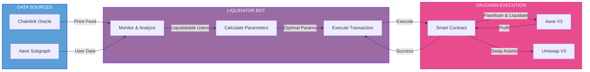

# Aave v3 Liquidator Bot

<p align="center">
  
</p>

<p align="center">
  <strong>Production-ready liquidation bot for Aave V3 on Base Network</strong>
</p>

<p align="center">
  <a href="#overview">Overview</a> •
  <a href="#getting-started">Getting Started</a> •
  <a href="#core-concepts">Core Concepts</a> •
  <a href="#architecture">Architecture</a> •
  <a href="#security">Security</a> •
  <a href="#faq">FAQ</a>
</p>

---

## Overview

### Introduction

Automated liquidation system for Aave V3 on Base Network. This system identifies and liquidates undercollateralized positions in real-time to maintain protocol health.

### Key Features

#### 
- Event-driven architecture with WebSocket
- Low latency execution
- Multicall batching for RPC optimization

#### 
- Implements Aave V3 close factor logic
- Evaluates collateral/debt combinations
- Dynamic gas management with EIP-1559
- Circuit breaker for risk management

#### 
- Full TypeScript implementation
- Modular service architecture
- Comprehensive test coverage
- Deployed on Base Mainnet

---

## Getting Started

### Prerequisites

Before running the bot, ensure your environment meets the following requirements:

#### System Requirements
- Node.js v20+
- npm or yarn
- Linux/macOS (recommended) or Windows WSL2

#### Key Dependencies

- **viem** v2.43.2: Blockchain interaction library
- **Foundry**: Solidity development & testing
- **TypeScript**: Type-safe implementation
- **Hardhat**: Contract compilation & testing

See [package.json](package.json) for complete list.

#### External Services
- RPC Provider with WebSocket support (Alchemy/Infura)
- Aave V3 Subgraph API key from The Graph
- Wallet with ETH for gas fees

### Installation

#### 1. Clone Repository
```bash
git clone https://github.com/yourusername/aave-liquidation-bot.git
cd aave-liquidation-bot
```

#### 2. Install Dependencies
```bash
# Install Node.js dependencies
npm install

# Install Foundry (for compiling Solidity contracts)
curl -L https://foundry.paradigm.xyz | bash
foundryup

# Install git submodules (Aave contracts)
git submodule update --init --recursive
```

#### 3. Compile Smart Contracts
```bash
# Compile with Foundry
forge build

# Generate TypeChain types
npx hardhat compile
```

### Configuration

#### 1. Environment Variables

```bash
cp .env.example .env
```

Edit `.env` with your configuration. See [.env.example](.env.example) for template and description of each variable.

### Quick Start

#### Run the Bot

```bash
# Development mode (with auto-reload)
npm run dev

# Production mode
npm run start

# With specific log level
LOG_LEVEL=debug npm run start
```

#### Monitor Logs

```bash
# Tail logs in real-time
tail -f logs/liquidator.log

# Filter for liquidation events
grep "Liquidation" logs/liquidator.log

# Monitor success rate
grep "SUCCESS\|FAILED" logs/liquidator.log | tail -n 20
```

#### Run Tests

```bash
# Run all Forge tests
forge test -vvv

# Run specific test file
forge test --match-path test/FlashloanLiquidator.t.sol

# Run with gas report
forge test --gas-report

# Run integration test (TypeScript)
npm run test:integration
```

---

## Core Concepts

### Health Factor

Health Factor (HF) is the metric that determines the health of a borrowing position in Aave.

**Formula:**
```
HF = (Total Collateral × Liquidation Threshold) / Total Debt
```

**Interpretation:**
- `HF > 1.0`: Healthy position (safe)
- `HF = 1.0`: Position at threshold (critical)
- `HF < 1.0`: Position can be liquidated (underwater)

**Example:**
| Health Factor | Status | Action |
|--------------|--------|--------|
| HF > 1.0 | Safe | No action needed |
| HF = 1.0 | Critical | At liquidation threshold |
| HF < 1.0 | Underwater | Eligible for liquidation |

### Liquidation Mechanism

Liquidation is the process where the liquidator pays the underwater user's debt and receives their collateral with a bonus.

**Process Flow:**
1. **Detection**: Bot detects HF < 1.0
2. **Calculation**: Calculate optimal debt to cover
3. **Flashloan**: Borrow debt asset without collateral
4. **Liquidation**: Call Aave's `liquidationCall()`
5. **Receive**: Receive collateral + liquidation bonus
6. **Swap**: Swap collateral → debt asset via Uniswap V3
7. **Repay**: Repay flashloan + fee (0.05%)
8. **Profit**: Keep the difference

**Atomic Transaction:**
All steps above happen in a single transaction. If any step fails, the entire transaction reverts.

### Close Factor

Close Factor determines the maximum percentage of debt that can be liquidated in a single transaction.

**Aave V3 Rules:**
```typescript
if (healthFactor >= 0.95) {
  closeFactor = 0.50; // Max 50% liquidation
} else if (healthFactor >= 0 && healthFactor < 0.95) {
  closeFactor = 1.00; // Max 100% liquidation (full liquidation)
}
```

**Thresholds & Bot Strategy:**
- `HF >= 0.95`: Position still recoverable → partial liquidation (50% max)
- `0.95 > HF >= 0`: Severely underwater → full liquidation allowed (100%)
- Bot uses `HF 1.03` as internal "high-risk" threshold (3% early detection cushion)
- Bot uses `HF 1.1` as "safe" threshold for removing users from monitoring cache

**Example:**
| Health Factor | Aave Close Factor | Bot Action | Urgency |
|--------------|------------------|-----------|---------|
| HF ≥ 1.1 | N/A | Remove from monitoring | None |
| 1.03 < HF < 1.1 | 50% | Cache update only | Low |
| 0.95 ≤ HF ≤ 1.03 | 50% | Immediate check + liquidate if viable | High |
| 0 < HF < 0.95 | 100% | Full liquidation eligible | Critical |

### Liquidation Bonus

Liquidation Bonus is an incentive for liquidators, given as a discount on the collateral received.

**Formula:**
```
Collateral Received = (Debt Covered × Debt Price / Collateral Price) × (1 + Bonus)
```

**Example:**
```
Scenario:
  Debt to cover: 100 USDC @ $1
  Collateral: 10 ETH @ $4,000
  Liquidation bonus: 10%

Calculation:
  Base collateral seized = (100 × 1) / 4000 = 0.025 ETH
  With bonus = 0.025 × (1 + 0.10) = 0.0275 ETH
  Value received = 0.0275 × 4000 = $110 (profit = $10)
```

---

## Advanced Features

### MustNotLeaveDust: Smart Liquidation Amount Adjustment

Aave V3 protocol prevents "dust" positions - balances below $1 USD equivalent per reserve. Bot implements intelligent dust prevention:

**How It Works:**
1. Detect: Calculate what debt and collateral will remain after liquidation
2. Check: Are leftovers less than $1 USD?
3. Adjust: If yes, increase liquidation amount to leave exactly $1.10 (safety margin)
4. Execute: Liquidate adjusted amount or skip if impossible

**Example Scenario:**
```
User has: 100 USDC debt, 10 ETH collateral
Bot wants to liquidate: 60 USDC
Result: 40 USDC leftover = $40 - No dust
Action: Liquidate 60 USDC

---

User has: 100 USDC debt (across multiple reserves)
Bot wants to liquidate: 60 USDC from one reserve
Issue: Debt leftover = $0.50 - DUST!
Solution: Adjust to 98.9 USDC
Result: $1.10 leftover - Safe
Action: Liquidate 98.9 USDC (nearly full)

---

Impossible to liquidate without leaving dust
Action: Skip - Return NULL, don't liquidate
```

**Code Implementation (OptimizedLiquidationService.prepareLiquidationParams):**
- Converts to BASE (8 decimals): MIN_LEFTOVER_BASE = 100000000 ($1)
- Applies SAFETY_MARGIN = 1.1 for $1.10 buffer
- Calculates two adjustment paths: debt-leftover and collateral-leftover
- Uses minimum of both paths for safety
- Returns NULL if impossible to avoid dust

### Flashblocks Integration: Preconfirmation Awareness

Bot uses three-client architecture for optimal Base Mainnet performance:

**Client Configuration:**
```typescript
walletClient:     http://mainnet-preconf.base.org    // TX broadcast
publicClient:     http://mainnet-preconf.base.org    // Receipt polling
rpcPublicClient:  config.network.rpcUrl             // Gas/Nonce (public RPC)
```

**Why Three Clients?**
| Client | Purpose | Network | Benefit |
|--------|---------|---------|---------|
| walletClient | Sign and broadcast TX | Flashblocks | Fast execution via sequencer |
| publicClient | Poll tx receipt | Flashblocks | Preconfirmation awareness (200ms timing) |
| rpcPublicClient | Gas estimation, nonce | Public RPC | Cost-effective for read-only ops |

**Receipt Polling Strategy:**
- Method: eth_getTransactionReceipt (standard JSON-RPC, not Beta)
- Interval: 100ms (optimized for 200ms flashblock timing)
- Timeout: 5 seconds (reasonable for preconfirmation window)
- Result: Receipt available = TX preconfirmed or on-chain

### Two-Phase Health Checking: Performance Optimization

When prices change, bot uses intelligent two-phase checking:

**Phase 1: High-Risk Users (Fast Path)**
```
Trigger: Chainlink price feed updates via WebSocket

Identify: Users with HF less than or equal to 1.03 (3% early detection cushion)

Action: Check on-chain health immediately

Result: Liquidate if viable, NO cache updates

Latency: approximately 500ms
```

**Phase 2: All Affected Users (Slow Path)**
```
Condition: No liquidation found in Phase 1

Identify: ALL users affected by price change

Action: Full health factor refresh on-chain

Result: Update user cache with latest HF

Latency: approximately 1-2 seconds
```

**Why Two-Phase?**
- Maximize speed for critical opportunities (Phase 1: 500ms)
- Minimize latency for cache updates (Phase 2: still less than 2s)
- Avoid redundant checks when liquidation found
- Prioritize execution over monitoring

### Multi-User Liquidation: Sequential Strategy

When multiple users are liquidatable, bot uses sequential execution:

**Flow Example:**
```
Price change detected

Find: 5 liquidatable users detected

Calculate: Optimal params for all 5 users

Rank: By estimated liquidation value
  - User A: $500 (Highest value)
  - User B: $350
  - User C: $200
  - User D: $150
  - User E: $100

Execute: User A only (highest value)
  - Broadcast TX
  - Poll receipt
  - Confirm success

Restart: Bot gracefully stops and exits
  - Fresh process start
  - Clean state and cache
  - Updated on-chain data

Next Cycle: Bot detects User B, C, D, E again
  - Process User B (now highest remaining)
  - Restart again
  - Repeat until no more opportunities
```

**Why Sequential?**
- Safety: Each liquidation gets fresh on-chain state (prices, health factors, nonces)
- Nonce Management: Simple sequential nonces, no parallel complexity
- Recovery: If one fails, next restart has clean state
- Monitoring: Easier to track and debug individual liquidations
- Reliability: No race conditions, no ordering issues

**Trade-off Analysis:**
- Sequential: Slower throughput but highly robust (production choice)
- Parallel: Faster throughput but complex nonce management (risky)
- Decision: Chose sequential for reliability over throughput

---

## Architecture

### System Overview

Bot built with modular architecture for scalability and maintainability.



### Services Breakdown

**Service Architecture:**
```
index.ts (LiquidatorBot - Orchestrator)
├─ PriceOracle
│  └─ Monitors Chainlink price feeds via WebSocket
│
├─ HealthChecker
│  └─ Fetches user health factors from Aave Pool
│
├─ SubgraphService
│  └─ Discovers liquidatable users from The Graph
│
├─ OptimizedLiquidationService (Core Logic)
│  ├─ selectBestPair() - Ranks collateral/debt combinations
│  ├─ prepareLiquidationParams() - Calculates debtToCover with dust prevention
│  └─ getLiquidationParamsForMultipleUsers() - Parallel multicall optimization
│
├─ LiquidationExecutor (Execution)
│  ├─ pollTransactionConfirmation() - Receipt polling helper
│  ├─ executeLiquidation() - Broadcast and monitor TX
│  └─ transferOwnership() - Post-liquidation cleanup
│
└─ UserPool
   └─ In-memory cache of at-risk users
```

**Service Details:**

| Service | Responsibility | Key Method | Latency |
|---------|---------------|-----------|---------| 
| PriceOracle | Real-time asset prices | startPriceMonitoring() | less than 100ms |
| HealthChecker | User solvency status | checkUsers() | approximately 500ms |
| SubgraphService | User discovery | getActiveBorrowers() | approximately 1s |
| OptimizedLiquidationService | Liquidation param calculation | getLiquidationParamsForMultipleUsers() | approximately 1-2s |
| LiquidationExecutor | TX execution and monitoring | executeLiquidation() | approximately 5-10s |
| UserPool | State caching | getUniqueCollateralAssets() | less than 1ms |

**Data Flow Example:**
```
1. PriceOracle: ETH price $4000 to $4200 (+5%)

2. handlePriceChange() identifies affected users

3. HealthChecker.checkUsers() finds 5 liquidatable users

4. OptimizedLiquidationService.getLiquidationParamsForMultipleUsers()
   - Fetches bitmaps (user reserve config)
   - Fetches reserve data and prices via multicall
   - Calculates optimal params for all 5
   - Applies dust prevention (MustNotLeaveDust)
   - Returns valid liquidations

5. selectBestLiquidation() ranks by value ($500, $350, $200...)

6. LiquidationExecutor.executeLiquidation() broadcasts and polls
   - walletClient: broadcast via flashblocks
   - Verify: sequencer acknowledgement
   - publicClient: poll receipt every 100ms
   - Result: success with TX hash

7. Profit secured, await bot.restart() for fresh state
```

### Smart Contract

See [contracts/FlashloanLiquidator.sol](contracts/FlashloanLiquidator.sol)

**Contract Functions:**
- executeFlashloan(): Initiates flashloan flow
- executeOperation(): Aave flashloan callback
- _liquidateAndSwap(): Core liquidation and swap logic
- _swapCollateral(): Uniswap V3 collateral swap

---

## Security

### Access Control

- **Smart Contract**: `onlyOwner` modifier for `executeLiquidation()`
- **Bot Wallet**: Private key/mnemonic must be stored securely
- **Environment Variables**: NEVER commit `.env` to git

### Circuit Breaker

Bot implements circuit breaker to prevent excessive losses with auto-stop on consecutive failures.

### Gas Management

- Fixed gas limit with safety buffer
- EIP-1559 strategy with priority fee
- Sensible limits to prevent gas wars

---

## FAQ

### General

**Q: How much capital is needed to run the bot?**
A: ETH is required for gas fees. The bot uses flashloans so large capital is not needed for liquidation.

**Q: What profit potential exists?**
A: Depends on network conditions and competition. Profit = (Liquidation Bonus × Collateral Value) - (Flashloan Fee + Gas Cost). Base Network typically: $10-500 per liquidation depending on market conditions.

**Q: Does the bot require Flashbots?**
A: Not required. Base Network public mempool is effective. Flashblocks (native Base preconfirmation) is used for faster execution but doesn't replace Flashbots functionality.

### Technical

**Q: How to add support for other networks?**
A: Update config with RPC URLs and addresses for target network. Contract supports any EVM chain with Aave V3.

**Q: Why use Subgraph instead of scanning all users on-chain?**
A: Subgraph provides efficient user discovery with minimal RPC calls.

**Q: How to optimize for lower latency?**
A: Use local node, co-locate server near sequencer, or consider more performant implementation.

**Q: Does the bot handle liquidation protocol fees?**
A: Yes, contract includes fee buffer to cover flashloan premium and swap fees.

### Troubleshooting

**Q: Bot doesn't detect liquidatable users**
A: Check: (1) Subgraph API key valid, (2) RPC connection working, (3) Users with HF < 1.0 exist

**Q: Transactions keep failing**
A: Check: (1) Wallet has enough ETH for gas, (2) Contract address correct, (3) User still liquidatable (HF < 1.0), (4) Competition frontrun transaction

**Q: How to monitor bot health?**
A: Check logs at `logs/liquidator.log`. Monitor for:
- `[SUCCESS]` liquidation messages
- `[FAILED]` transaction failures  
- `Circuit breaker` trigger patterns
- `RPC error` patterns
- `Final Statistics` on shutdown (success rate, gas spent)

**Q: Bot crashes on startup**
A: Check: (1) All env variables set, (2) Contract deployed, (3) RPC URL reachable, (4) Dependencies installed

---

## Implementation Details

### Configuration Constants

Bot behavior is controlled by configurable constants in **OptimizedLiquidationService** and **index.ts**:

**OptimizedLiquidationService.ts:**
```typescript
private readonly BASE_CURRENCY_DECIMALS = 8;         // Aave oracle standard decimals
private readonly MIN_LEFTOVER_BASE = 100000000;      // $1 USD (8 decimals)
private readonly SAFETY_MARGIN = 1.1;                // $1.10 dust prevention buffer
private readonly MIN_LIQUIDATION_VALUE_USD = 100;    // Skip opportunities < $100
```

**index.ts:**
```typescript
const HIGH_RISK_HF_THRESHOLD = 1.03;   // Trigger immediate liquidation check
const SAFE_HF_THRESHOLD = 1.1;         // Remove user from monitoring cache
const FIXED_GAS_LIMIT = 920000n;       // Calibrated to FlashloanLiquidator.sol
```

**How to Tune Parameters:**
| Constant | Current | Purpose | Increase | Decrease |
|----------|---------|---------|----------|----------|
| MIN_LIQUIDATION_VALUE_USD | $100 | Skip low-value opportunities | More selective, higher profit/TX | More frequent execution, lower profit/TX |
| HIGH_RISK_HF_THRESHOLD | 1.03 | Early detection (3% cushion) | Faster detection, miss fewer | More false positives |
| SAFE_HF_THRESHOLD | 1.1 | Cache management (10% cushion) | Lean monitoring, less memory | More memory usage, slower cache |
| FIXED_GAS_LIMIT | 920,000 | TX gas allowance | Higher gas cost/TX | Risk TX OOG failure |

### Execution Flow: Transaction Lifecycle

**Step-by-step what happens during liquidation:**

```
PHASE 1: PREPARATION
Input: collateral, debt, user, debtToCover, gasSettings
OptimizedLiquidationService: Validates params
LiquidationExecutor: Encodes function data

PHASE 2: BROADCAST (Flashblocks)
walletClient.sendTransaction() signs TX
Sends to http://mainnet-preconf.base.org (sequencer)
Returns: TX hash

PHASE 3: SEQUENCER VERIFY
Call base_transactionStatus RPC
Check: status = 'Known' (TX in sequencer memory)
Timeout: 2 seconds

PHASE 4: NONCE CONFIRM
NonceManager.confirmNonce() increments tracked nonce
Ensures next TX gets correct nonce

PHASE 5: RECEIPT POLL (100ms interval)
pollTransactionConfirmation() helper
eth_getTransactionReceipt() every 100ms
Timeout: 5 seconds (preconfirmation aware)
Result: receipt found = preconfirmed or on-chain

PHASE 6: COMPLETE
success = true: Liquidation confirmed
success = false: TX failed
Return: { txHash, gasUsed, success }

PHASE 7: RESTART
await bot.restart()
Gracefully stops
systemd restarts: fresh state and correct nonce
```

**Why Restart After Each Liquidation?**
- Fresh on-chain data (prices, health factors, nonces)
- Clean in-memory cache (no stale user data)
- Guaranteed correct nonce sequence
- Automatic recovery from temporary issues

### Optimization Techniques

**1. Multicall Batching**
```
Without: 100+ individual RPC calls
With:    3-4 batched multicall operations
Saving:  approximately 500-1000ms latency reduction
```

**2. Reserve Config Cache**
```
Warmup:  Fetch decimals and bonus once at startup
Reuse:   Use cached for every calculation
Benefit: Avoid redundant lookups per cycle
```

**3. Two-Phase Health Checking**
```
Phase 1: Check high-risk only (HF less than or equal to 1.03) - fast path 500ms
Phase 2: Update cache for all affected - slow path 1-2s
Result:  Optimized for both execution speed and monitoring
```

**4. Three-Client Architecture**
```
Flashblocks: walletClient + publicClient (TX and receipt)
Public RPC:  rpcPublicClient (gas/nonce, read-only)
Benefit:     Cost-effective, optimal performance
```

**5. Sequential Execution**
```
Strategy: Execute 1 user, restart, execute next
Benefits: Simple nonce management, clean state
Trade:    Lower throughput, higher reliability
```

---

## Contributing

Contributions are welcome! Please follow these guidelines:

### How to Contribute

1. Fork the repository
2. Create a feature branch (git checkout -b feature/amazing-feature)
3. Commit your changes (git commit -m 'Add amazing feature')
4. Push to the branch (git push origin feature/amazing-feature)
5. Open a Pull Request

### Development Guidelines

- Follow existing code style (TypeScript and Prettier)
- Add tests for new features
- Update documentation if API changes
- Keep commits atomic and well-described

### Reporting Issues

Use GitHub Issues for:
- Bug reports
- Feature requests
- Documentation improvements

Include:
- Clear description
- Steps to reproduce (for bugs)
- Expected vs actual behavior
- Environment details (OS, Node version, etc.)

---

## License

This project is licensed under the MIT License - see the LICENSE file for details.

---

## Connect

- GitHub: [nodesemesta](https://github.com/nodesemesta)
- Discord: [nodesemesta](https://discord.com/users/760709262694416435)
- Twitter: [@nodesemesta](https://twitter.com/nodesemesta)
- Email: [nodesemesta@gmail.com](mailto:nodesemesta@gmail.com)

## Support Research

If you find this project useful and would like to support continued development and research:

Ethereum: `0x04898c077eb5f6e3dc5f6086cd96ceeed523cd81`

---

<p align="center">
  Made with ❤️ by <a href="https://github.com/nodesemesta">Nodesemesta</a>
</p>

<p align="center">
  <sub>Built for Base Network • Powered by Aave V3 • Optimized for Performance</sub>
</p>